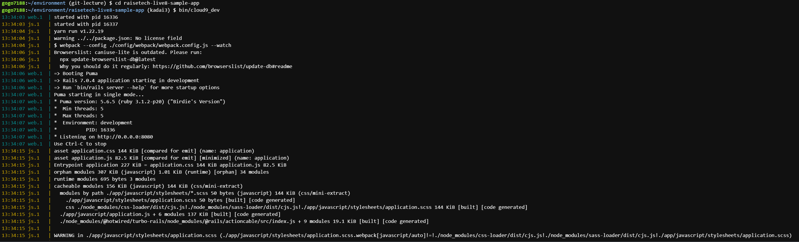

# 第三回課題  
## ・Rails 7.0.4  
## ・アクセスできない。$ rails sで起動  
## ・MySQL 8.0.33  
## ・出来ない  
## ・gem  
## ・webアプリケーションはクライアントとサーバーの関係性でありリクエストとレスポンスの要素を持つ  
## ・Ruby on Railsを使う際はgemというパッケージを使用すると作業を効率化できる  
## ・データベースにはMySQLがよく使われる  
  
  
APサーバーの名前とバージョンの根拠  
  
アプリケーション起動の根拠  
  
サービス停止した根拠  
  
アプリケーションを起動できない根拠  
  
Rails起動の根拠  
  
DBサーバーの名前とバージョンの根拠  
  
サーバー停止するとアクセスできない根拠